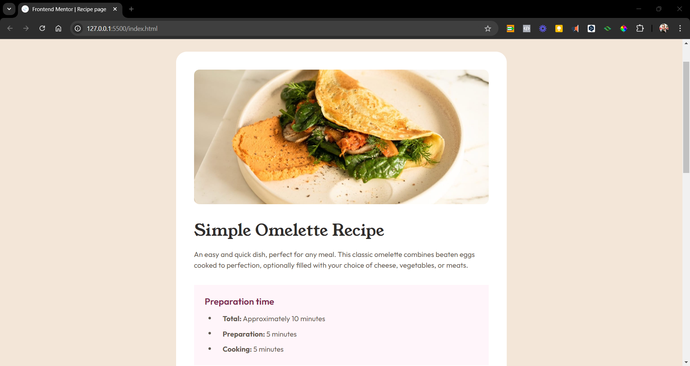

# Frontend Mentor - Recipe page solution

This is a solution to the [Recipe page challenge on Frontend Mentor](https://www.frontendmentor.io/challenges/recipe-page-KiTsR8QQKm). Frontend Mentor challenges help you improve your coding skills by building realistic projects. 

## Table of contents

- [Overview](#overview)
  - [The challenge](#the-challenge)
  - [Screenshot](#screenshot)
  - [Links](#links)
- [My process](#my-process)
  - [Built with](#built-with)
  - [Useful resources](#useful-resources)
- [Author](#author)

## Overview

### Screenshot

### Links

- Solution URL: [GitHub](https://github.com/ricramcezar/fep-recipe-page.git)
- Live Site URL: [Recipe Page](fep-recipe-page.netlify.app)

## My process

### Built with

- Semantic HTML5 markup
- CSS custom properties
- Flexbox
- Mobile-first workflow

### Useful resources

- [MDN Web Docs](https://developer.mozilla.org) - Resources for Developers by Developers.

## Author

- Frontend Mentor - [@ricramcezar](https://www.frontendmentor.io/profile/ricramcezar)
- LinkedIn - [@ricardocezarpro](https://www.linkedin.com/in/ricardocezarpro)